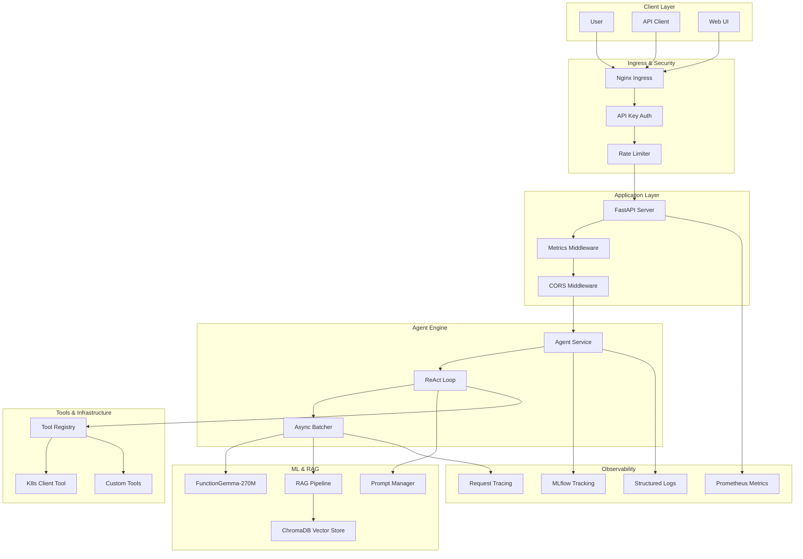

# FunctionGemma Agent

[](https://github.com/your-org/function-gemma-agent/actions)
[](https://codecov.io/gh/your-org/function-gemma-agent)
[](https://opensource.org/licenses/MIT)
[](k8s/chart/)

> **High-Performance LLM Agent Platform** - Production-grade ReAct agent with RAG, tool execution, and observability built on FastAPI and FunctionGemma-270M.

## 🚀 Quick Start

```bash
# Clone and run locally
git clone https://github.com/your-org/function-gemma-agent.git
cd function-gemma-agent
pip install -e ".[dev]"
uvicorn app.main:app --reload

# Or deploy with Docker Compose
docker-compose up -d

# Deploy to Kubernetes
helm install function-gemma-agent k8s/chart/ --namespace production --create-namespace
```

## 📋 Architecture Overview



## ✨ Key Features

- 🤖 **ReAct Reasoning Loop** - Multi-step reasoning with tool execution
- 📚 **RAG Pipeline** - ChromaDB-powered knowledge retrieval
- 🛠️ **Extensible Tools** - Python-based tool registry with K8s integration
- 📊 **Full Observability** - MLflow, Prometheus, structured logging
- 🚀 **Production Ready** - Helm charts, CI/CD, autoscaling, canary deployments
- 🔒 **Enterprise Security** - API auth, rate limiting, security contexts
- ⚡ **High Performance** - Async batching, model warm-up, connection pooling

## 🏗️ System Components

### Core Services
- **FastAPI Application** (`app/main.py`) - REST API with middleware stack
- **Agent Service** (`app/domain/agent.py`) - Orchestrates ReAct reasoning
- **Inference Engine** (`app/inference/engine.py`) - ML model execution & tracing

### Intelligence Layer
- **ReAct Loop** (`app/inference/react_loop.py`) - Think-Act-Observe reasoning
- **RAG Retriever** (`app/rag/retriever.py`) - Vector search & context injection
- **Tool Registry** (`app/infrastructure/tools/registry.py`) - Dynamic tool execution

### Infrastructure
- **ML Service** (`app/infrastructure/ml/`) - FunctionGemma model wrapper
- **Vector Store** (`app/rag/store.py`) - ChromaDB integration
- **Monitoring** (`app/observability/`) - Metrics and tracing

## 📖 Documentation

- [**Architecture Deep Dive**](docs/ARCHITECTURE.md) - System design and decisions
- [**Operations Guide**](docs/OPERATIONS.md) - Deployment, scaling, troubleshooting
- [**API Documentation**](https://agent.example.com/docs) - Interactive OpenAPI docs
- [**Kubernetes Deployment**](k8s/README.md) - Helm charts and K8s configs

## 🧪 Development

### Setup

```bash
# Python 3.10+ required
python -m venv venv
source venv/bin/activate  # Windows: venv\Scripts\activate
pip install -e ".[dev]"
```

### Testing

```bash
# Run all tests
pytest

# With coverage
pytest --cov=app --cov-report=html

# Type checking
mypy app/

# Linting
ruff check .
black .
```

### Adding Tools

See [Tutorial: Adding a New Tool](docs/tutorials/TUTORIAL-01-ADD-TOOL.md)

```python
from app.infrastructure.tools.base import BaseTool

class MyTool(BaseTool):
    name = "my_tool"
    description = "Does something useful"
    
    def execute(self, arg1: str) -> dict:
        return {"result": f"Processed: {arg1}"}
```

## 🚢 Deployment

### Docker

```bash
# Build
docker build -f deployment/Dockerfile -t function-gemma-agent .

# Run
docker run -p 8000:8000 -v $(pwd)/data:/app/data function-gemma-agent
```

### Kubernetes

```bash
# Install
helm install function-gemma-agent k8s/chart/ \
  --namespace production \
  --create-namespace \
  --set image.tag=latest

# Upgrade
helm upgrade function-gemma-agent k8s/chart/ \
  --namespace production \
  --set replicaCount=5

# Rollback
helm rollback function-gemma-agent 0 -n production
```

### Environment Variables

| Variable | Default | Description |
|----------|---------|-------------|
| `ENV` | `development` | Environment (development/staging/production) |
| `LOG_LEVEL` | `INFO` | Logging level |
| `API_V1_STR` | `/api/v1` | API prefix |
| `MLFLOW_TRACKING_URI` | `http://localhost:5000` | MLflow server |
| `CHROMA_PERSIST_DIRECTORY` | `./data/chroma` | Vector store path |

## 📊 Monitoring

### Health Checks
- Application: `GET /api/v1/health`
- Metrics: `GET /api/v1/metrics` (Prometheus format)

### Key Metrics
- `http_requests_total` - Request count by status
- `http_request_duration_seconds` - Request latency
- `agent_reasoning_steps_total` - ReAct loop iterations
- `tool_execution_total` - Tool usage count
- `rag_retrieval_latency_seconds` - RAG query time

### Dashboards
- Grafana dashboard ID: `function-gemma-agent`
- MLflow experiment: `function-gemma-agent`

## 🤝 Contributing

1. Fork the repository
2. Create a feature branch (`git checkout -b feature/amazing-feature`)
3. Commit your changes (`git commit -m 'Add amazing feature'`)
4. Push to the branch (`git push origin feature/amazing-feature`)
5. Open a Pull Request

## 📄 License

This project is licensed under the MIT License - see the [LICENSE](LICENSE) file for details.

## 🙏 Acknowledgments

- [Google](https://github.com/google) for the FunctionGemma model
- [FastAPI](https://fastapi.tiangolo.com/) for the web framework
- [ChromaDB](https://www.trychroma.com/) for the vector database
- [Helm](https://helm.sh/) for Kubernetes package management

---

Built with ❤️ by the [Your Organization](https://github.com/your-org) team
