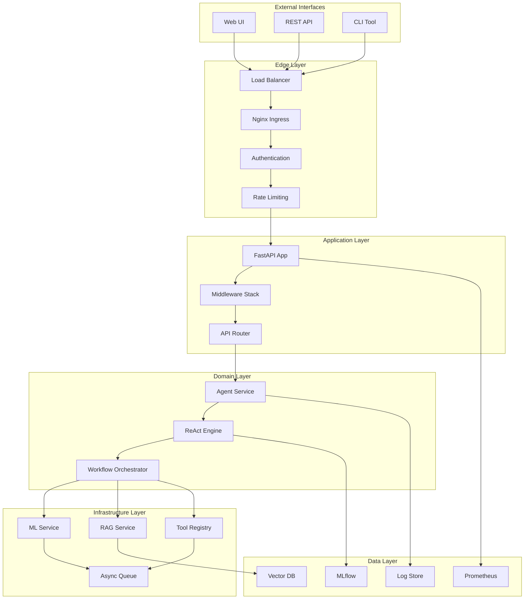
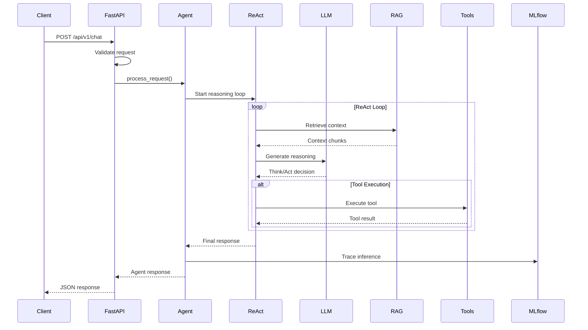
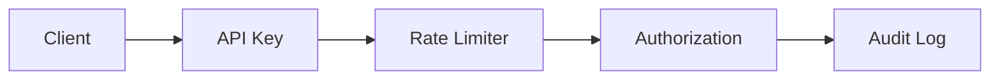

# Architecture Documentation

## Table of Contents

1. [System Overview](#system-overview)
2. [Core Components](#core-components)
3. [Design Decisions](#design-decisions)
4. [Data Flow](#data-flow)
5. [Component Deep Dive](#component-deep-dive)
6. [Performance Considerations](#performance-considerations)
7. [Security Architecture](#security-architecture)
8. [Scalability Patterns](#scalability-patterns)

## System Overview

The FunctionGemma Agent is a production-grade LLM agent platform built on a microservices architecture with strong separation of concerns. The system follows Domain-Driven Design (DDD) principles and implements the ReAct (Reasoning and Acting) paradigm for multi-step task execution.

### High-Level Architecture



## Core Components

### 1. FastAPI Application Layer

**Location**: `app/main.py`, `app/api/`

The FastAPI application serves as the entry point, providing:
- RESTful API endpoints
- Request validation and serialization
- Middleware for cross-cutting concerns
- OpenAPI documentation generation

Key features:
- Async request handling
- Automatic request/response validation with Pydantic
- Integrated Swagger UI
- Middleware stack for metrics, CORS, and security

### 2. Agent Service (Domain Layer)

**Location**: `app/domain/agent.py`

The Agent Service is the core orchestrator that:
- Manages the ReAct reasoning loop
- Coordinates between ML inference and tool execution
- Handles request lifecycle and error recovery
- Maintains conversation context

```python
class AgentService:
    async def process_request(self, request: AgentRequest) -> AgentResponse:
        # 1. Prepare tools schema
        # 2. Execute ReAct reasoning loop
        # 3. Collect training data
        # 4. Trace with MLflow
        # 5. Return structured response
```

### 3. ReAct Engine

**Location**: `app/inference/react_loop.py`

The ReAct (Reasoning and Acting) engine implements:
- **Think**: Generate reasoning steps using the LLM
- **Act**: Execute tools based on reasoning
- **Observe**: Process tool results and update context

The loop continues until:
- Task completion is detected
- Maximum iterations reached
- Error threshold exceeded

### 4. RAG Pipeline

**Location**: `app/rag/`

The Retrieval-Augmented Generation pipeline:
- **Embedding Generation**: Convert queries to vectors
- **Similarity Search**: Find relevant documents in ChromaDB
- **Context Formatting**: Structure retrieved information
- **Prompt Injection**: Merge context into model prompts

### 5. Tool Registry

**Location**: `app/infrastructure/tools/registry.py`

Dynamic tool execution system:
- **Registration**: Tools register with schema validation
- **Discovery**: Runtime tool discovery and schema generation
- **Execution**: Sandboxed tool execution with error handling
- **Extensibility**: Easy addition of new tools

## Design Decisions

### Why FastAPI?

| Decision | Rationale |
|----------|-----------|
| **Async Support** | Native async/await for high concurrency |
| **Type Safety** | Pydantic integration for request validation |
| **Performance** | One of the fastest Python web frameworks |
| **Documentation** | Auto-generated OpenAPI specs |
| **Ecosystem** | Rich middleware and plugin ecosystem |

### Why ChromaDB?

| Decision | Rationale |
|----------|-----------|
| **Lightweight** | Embedded mode for easy deployment |
| **Performance** | Optimized for vector similarity search |
| **Python Native** | Seamless integration with Python stack |
| **Metadata Filtering** | Advanced filtering capabilities |
| **Open Source** | No vendor lock-in |

### Why Helm?

| Decision | Rationale |
|----------|-----------|
| **Kubernetes Native** | Standard for K8s package management |
| **Templating** | Environment-specific configurations |
| **Rollback** | Built-in versioning and rollback |
| **Ecosystem** | Rich chart repository ecosystem |
| **CI/CD Integration** | Native GitHub Actions support |

### Why FunctionGemma-270M?

| Decision | Rationale |
|----------|-----------|
| **Size** | Small enough for edge deployment |
| **Performance** | Fast inference on CPU |
| **Function Calling** | Native tool execution support |
| **Open Source** | Fully permissive license |
| **Quality** | Google's latest model architecture |

## Data Flow

### Request Processing Flow



### Error Handling Flow

1. **Tool Execution Error**: ReAct loop retries with alternative approach
2. **LLM Generation Error**: Falls back to simpler prompt
3. **RAG Retrieval Error**: Continues without context
4. **Circuit Breaker**: Stops failing components after threshold
5. **Graceful Degradation**: Always returns a response, even if limited

## Component Deep Dive

### Async Batching Engine

The batching engine optimizes LLM inference:

```python
class AsyncBatcher:
    def __init__(self, batch_size: int = 8, timeout_ms: int = 100):
        self.batch_queue = asyncio.Queue()
        self.batch_size = batch_size
        self.timeout_ms = timeout_ms
    
    async def process_batch(self):
        # Collect requests up to batch_size or timeout
        # Process as single batch
        # Distribute responses to original requests
```

Benefits:
- **Throughput**: Up to 8x improvement for concurrent requests
- **Latency**: Batching timeout ensures responsiveness
- **Resource Efficiency**: Optimal GPU/CPU utilization

### Prompt Management

**Location**: `app/prompts/system.py`

Centralized prompt management with:
- **Templates**: Jinja2-based prompt templates
- **Versioning**: Track prompt changes over time
- **A/B Testing**: Compare prompt performance
- **Context Injection**: Dynamic context insertion

### Training Data Collection

**Location**: `app/training/collector.py`

Automatic collection of:
- **Prompt-Response Pairs**: For fine-tuning
- **Tool Execution Traces**: For tool optimization
- **Reasoning Chains**: For chain-of-thought training
- **User Feedback**: For RLHF

## Performance Considerations

### Latency Optimization

1. **Model Warm-up**: Pre-load model at startup
2. **Connection Pooling**: Reuse HTTP/database connections
3. **Async Operations**: Non-blocking I/O throughout
4. **Caching**: Vector cache for frequent queries
5. **Batching**: Group LLM requests when possible

### Memory Management

1. **Model Quantization**: Reduce memory footprint
2. **Context Window**: Limit prompt length
3. **Garbage Collection**: Regular cleanup of old contexts
4. **Streaming**: Stream large responses

### Scalability Patterns

1. **Horizontal Scaling**: Stateless design for easy scaling
2. **Queue-Based Processing**: Decouple inference from API
3. **Microservices**: Independent scaling of components
4. **Circuit Breakers**: Prevent cascading failures

## Security Architecture

### Authentication & Authorization



- **API Key Authentication**: Simple, secure key-based auth
- **Rate Limiting**: Per-key rate limits (10 req/min default)
- **IP Whitelisting**: Optional IP-based access control
- **Audit Logging**: All requests logged with user context

### Data Security

1. **Encryption**: TLS 1.3 for all communications
2. **Secrets Management**: Kubernetes secrets for sensitive data
3. **PII Redaction**: Automatic detection and redaction
4. **Data Retention**: Configurable retention policies

### Container Security

1. **Non-root User**: Containers run as UID 1000
2. **Read-only FS**: Root filesystem is read-only
3. **Minimal Base**: Python slim image
4. **Security Scanning**: Trivy integration in CI/CD

## Scalability Patterns

### Kubernetes Scaling

```yaml
# Horizontal Pod Autoscaler
apiVersion: autoscaling/v2
kind: HorizontalPodAutoscaler
spec:
  minReplicas: 3
  maxReplicas: 10
  metrics:
  - type: Resource
    resource:
      name: cpu
      target:
        type: Utilization
        averageUtilization: 70
```

### Database Scaling

1. **Read Replicas**: For read-heavy workloads
2. **Sharding**: Horizontal partitioning
3. **Caching Layers**: Multiple cache tiers
4. **Connection Pooling**: Efficient connection reuse

### Message Queues

1. **Request Batching**: Group similar requests
2. **Priority Queues**: Urgent requests first
3. **Dead Letter Queues**: Handle failed messages
4. **Backpressure**: Prevent overload

## Monitoring & Observability

### Three Pillars of Observability

1. **Metrics**: Prometheus metrics for quantitative data
2. **Logs**: Structured JSON logs with correlation IDs
3. **Traces**: MLflow for ML-specific tracking

### Key Performance Indicators

- **Request Latency**: P50, P95, P99 percentiles
- **Throughput**: Requests per second
- **Error Rate**: 4xx/5xx percentages
- **Resource Utilization**: CPU, memory, GPU
- **Model Metrics**: Token usage, inference time

### Alerting Strategy

1. **SLI/SLO**: Service level indicators and objectives
2. **Error Budgets**: Allowable error thresholds
3. **Escalation Policies**: Multi-level alert routing
4. **Runbooks**: Automated response procedures

## Future Architecture Considerations

### Potential Enhancements

1. **Multi-Model Support**: Switch between models based on task
2. **Federated Learning**: Privacy-preserving model updates
3. **Edge Deployment**: Local inference for low latency
4. **Model Registry**: Centralized model version management

### Migration Paths

1. **Strangler Pattern**: Gradually replace components
2. **Feature Flags**: Toggle new features safely
3. **Canary Releases**: Gradual rollout
4. **Blue-Green**: Zero-downtime deployments

---

This architecture documentation serves as the authoritative guide for understanding the FunctionGemma Agent's design decisions and implementation patterns. For specific operational procedures, see the [Operations Guide](OPERATIONS.md).
